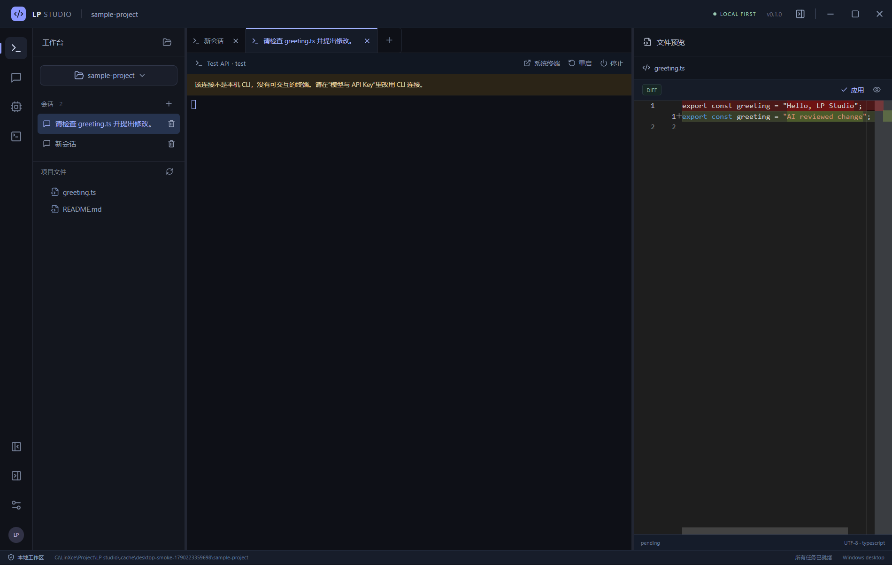
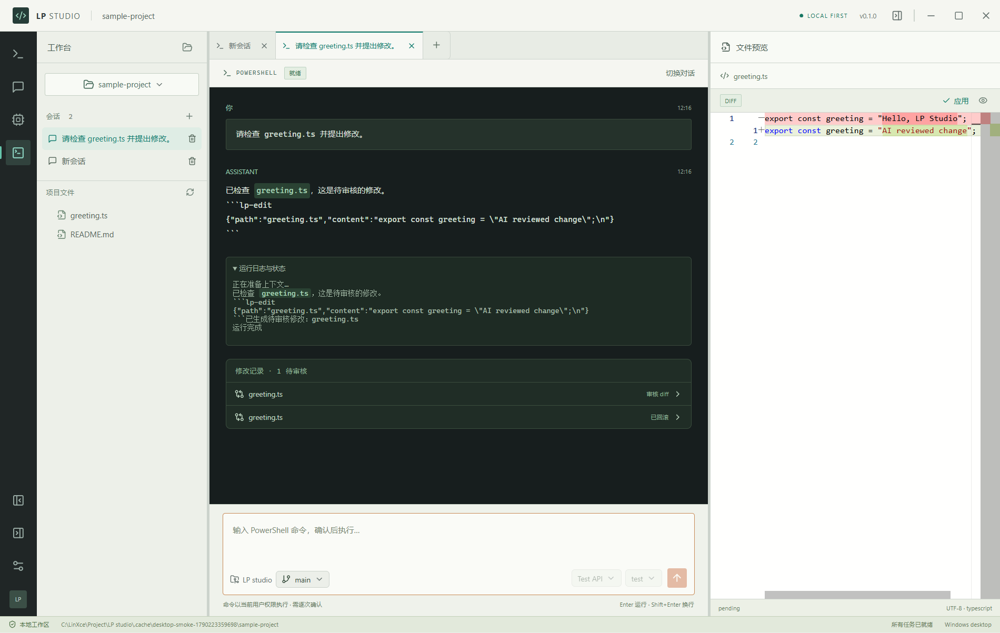

# LP Studio — 多模型 CLI 桌面助手

本地优先的 **Windows 桌面应用**，不是需要部署的网站。Electron 打包 Chromium 和 Node 运行时，双击 EXE 即可使用；生产版从本机加载 UI，没有 Web 服务或浏览器登录入口。



## 导航与主题

左侧图标只切换第三栏：工作台显示对话，会话页浏览与搜索当前项目的历史，模型页管理 CLI/API 连接，终端页输入命令，设置页管理外观与本地数据。项目栏和文件预览保持独立，不会被导航弹窗遮挡；执行命令和应用文件修改仍保留操作确认，由跟随主题的应用弹窗展示。

页面切换带有 180ms 淡入与轻微位移动画，遵循系统“减少动画”设置。切换页面保留未发送的对话/命令草稿、未保存的模型表单和后台任务；这些草稿只在当前窗口内保留，刷新或关闭不会保存。Ctrl+L 返回之前的对话或命令输入框。

点击左下角 **设置 → 外观主题**：

- **午夜深蓝**：保留原有深色工作区。
- **工业浅色**：浅灰白面板、深色终端、青绿选中标记和橙色操作按钮。

主题立即应用并在当前应用配置中保存，重新打开仍生效；Monaco 代码预览与 diff 同步切换明暗配色。开发模式和便携 EXE 使用各自的数据目录，主题选择也分别保存。



UI 页面、布局与配色分别维护：`apps/ui/src/Settings.tsx`、`Sessions.tsx`、`Models.tsx` 为页面组件，`workspace.css` 为中央工作区布局与动画，`theme.ts` 和 `themes.css` 为主题声明、存储与配色；选择弹层由 `OptionSelect.tsx` 统一提供，输入框底栏由 `GitBadge.tsx`（仓库与分支）和 `SessionPicker.tsx`（CLI 与模型）组成。这些修改不涉及 Provider 和桌面 IPC。

## 终端（当前主界面）

中央工作区是**真正运行本机 CLI 的终端**：PTY（Windows 上用 ConPTY，经 `node-pty`）直接把所选 CLI 拉起，你看到的就是它自己的交互界面，行为和你在 cmd 里手敲完全一致——包括它的多选一提问、plan 模式、工具授权。

- 空状态：正中间选连接与模型，点「新建会话」；选中会话后终端在该项目目录运行。新建会话**一律先经过这一步**——左侧栏的「+」、会话页的「新建」、终端标签栏的「+」都只是回到这个选择界面，不会用默认连接直接建会话。
- 终端视图顶部有**会话标签栏**：点击切换、× 关闭标签、右侧「+」新建。
- 工具条显示「连接 · 模型」，并提供「系统终端」（把同一个 CLI 在真正的 cmd 窗口里打开，输入法与渲染交给系统，可用来对照排查）、「重启」（用当前模型重新拉起）与「停止」。
- 启动参数：交互式终端用 `cmdc --model <模型> --trust --skip-onboarding --no-auto-update`。`--trust` 跳过 CLI 的"是否信任此文件夹"确认、`--skip-onboarding` 跳过 taste 引导——**不加这两个时 TUI 会停在确认屏上不接收输入，第一次回车只是在回答那个屏**（实测：加之前整屏没有横幅，只有确认屏）。`--trust` 等于替你回答了"信任此文件夹"，这是让终端可用的前提，请注意这个含义。
- 中文输入法：**组合处理完全交给 xterm，本应用只做观察记录**。曾经在这里拦截 `compositionstart/update/end` 想绕开 xterm 的组合态，但真机追踪证明那样反而把"正在组合"这件事对 xterm 隐藏了：它把每次拼音更新当普通输入转发给 CLI（第一个字符），我们再在提交时送一次（第二个字符），于是出现"终端里出现字符 + 上屏后两个字符"。现在只挂观察者、不做 `stopPropagation`，组合与提交都由 xterm 原生处理。
  - 正常的输入法行为（不是 bug）：拼音期间终端里**不会**出现字符（只有输入法自己的候选窗显示），第一次回车是**选词/上屏**、不提交给 CLI，再回车才发送。
  - 候选框位置（实测数据）：锚点是 xterm 藏在光标单元格上的输入框，cmdc 画完满宽输入框边框后把（隐藏的）光标留在第 20 行第 97 列——**终端最后一列**，所以候选框出现在终端右外侧。这是 CLI 自己的光标位置，真实控制台会锚在同一个 caret，CSS 改不了。想完全交给系统输入法就用工具条的「系统终端」。
  - 诊断：开发版会把终端输入链路逐条打成 `[term] …` 日志（`keydown` 的 code/isComposing、`input` 的 inputType/isComposing/data、`composition*`、每次写入 PTY 的内容，以及 `spawn` 的实际参数），主进程会把这些行转发到启动应用的控制台窗口。
- 启动期输入：**TUI 起来后要几秒才开始读 stdin**（真机实测：cmdc 启动后约 7 秒内按键完全不响应，之前打进控制台的内容会被丢弃）。因此终端在 CLI 安静下来之前会把你的按键**缓存**，并在就绪后一次性补发；这段时间工具条下方会显示「CLI 正在启动 —— 这段时间的输入会缓存，就绪后自动送出」，提示消失即表示已就绪。若提示已消失但仍无响应，那就是 CLI 自身还没准备好。
- 模型在启动时固定；要换模型请点「重启」，或新建会话。
- 切换会话会结束上一个终端；窗口重载（Ctrl+R / 开发时热重载）也会终止终端，这是有意为之——渲染进程丢失缓冲后重新挂接只会显示错乱。
- 「终端命令」页仍是一次性 PowerShell（逐次确认），是新终端之外唯一的 shell 入口；新终端只跑 CLI，不含 shell。
- 依赖：`node-pty` 是可选依赖。缺失时应用照常可用，终端会明确提示并给出补救命令。开发机上 `scripts/install.mjs` 会检测并报告其状态。
- 开发时若控制台出现 `AttachConsole failed`，那是 node-pty 枚举进程树的内部 helper 在无控制台进程里的正常报错，不影响终端使用。
- 为什么不用原先的结构化对话：headless（`-p`）会扣留 `ask_user_question`、`enter_plan_mode`、`exit_plan_mode`、`plan_review`、`todo_write` 等工具，CLI 也无法中途请求权限，因此无法复现交互行为。对话视图与 lp-edit diff 审核仍保留在代码里（`apps/ui/src/views.ts` 的 `chatView`），把它改为 `true` 即可切回。
- 代价：终端里 CLI 按自身权限直接读写文件，不再经过应用的 diff 审核；它也不是操作系统沙箱。

## 选择面板、Git 与底部通知（对话视图，当前隐藏）

工作台里所有非表单的选择共用同一套弹层：项目、CLI/API 连接、模型、Git 分支。触发器显示当前值，点击后在触发器的上方或下方展开列表，支持 ↑↓ 与回车，Esc 或点击外部关闭。面板没有搜索框，也没有收藏。表单里的下拉框（如适配器类型、超时）仍使用系统控件。

输入框下方一行左侧显示当前项目的 Git 仓库名和分支，右侧是 CLI/API 连接与模型。

- 分支列表来自本地分支，选中后由主进程弹出确认框，再执行 `git checkout`：只切换到本地已有分支，不访问远端、不丢弃提交，项目内有运行任务时会被拒绝。未提交改动可能保留或导致切换失败，由 Git 自身报错。项目不在 Git 仓库中时显示“无 Git 仓库”。
- 模型列表来自当前连接配置的模型与别名，可点“填写模型 ID”手动输入。只有 Command CLI（cmdc）提供“读取本机模型目录”，会调用本机 CLI 枚举模型；其他连接（包括 Antigravity）只做 `--version` 检测，不查询模型目录。
- 会话的 CLI/模型锁定规则不变：空白会话可改，首次发送后固定。
- 底部通知按提示等级区分颜色：信息为中性蓝、成功为绿、警告为琥珀、错误为红，两套主题各有对应配色。错误与警告使用 `role="alert"`，信息与成功使用 `role="status"`，约 4 秒后自动消失。

## 工具授权与重试

运行对话不再弹出确认框：按 Enter 直接开始，目标连接与模型在输入框底栏可见。应用内联的文件、命令执行、应用/回滚和删除仍保留主题确认框。

CLI 适配器跑在 headless 模式，CLI **不会在运行中询问权限**（cmdc 的 `headlessInteraction` 对任何带风险的调用直接返回 deny）。所以应用把“工具被拒绝”当作权限信号：

- 模型的工具调用被拒绝时，对话流里出现一条**授权气泡**，写明工具名、目标路径和将要授予的权限。
- 「允许并重新执行」把授权写入该会话（`Session.grants`），并用同一提示词重试本轮；「忽略」只关闭气泡。
- 授权只作用于当前会话，新建会话自动重置；输入框下方出现「已授权 N 项 · 清除」可随时撤销。
- 两种授权：**目录授权**（被拒路径真实存在且位于项目外，cmdc 加 `--add-dir`）与**全部工具**（cmdc 改用 `--yolo`，同时允许写文件与执行命令）。授权不起作用时不会静默卡住：目录授权仍被拒会升级为「允许全部工具」的第二次询问；已经给了全部工具而仍被拒，则明确提示更换模型或新建会话，而不是再弹一次无效气泡。
- 目前只有 Command CLI 会把授权映射成 CLI 参数（适配器的 `supportsGrants`）；其他 CLI 的拒绝只在运行日志中显示，不弹授权气泡。

## 启动

- 已打包版本：双击 `release/win-unpacked/LP Studio.exe`。
- 开发版：安装 Node.js 22.12+（本项目验证环境为 Node 24），在项目目录执行：

```powershell
npm.cmd run setup:mirror
npm.cmd run dev
```

也可双击 `启动开发版.cmd`。PowerShell 禁止运行 npm.ps1 时使用 npm.cmd，无需修改系统执行策略。

```powershell
npm.cmd run check         # 类型、安全/流协议/进程测试、UI 依赖边界
npm.cmd run build         # 本地 UI 与桌面主进程
npm.cmd run test:desktop  # 实际 Electron 窗口测试；先 build
npm.cmd run pack:win      # Windows x64 便携目录
```

首次安装需联网下载依赖和 Electron；锁文件固定依赖。`pack:win` 使用已经安装的 Electron。不要把开发依赖或缓存作为发布包。

## 安装时遇到网络问题

双击 `安装依赖-国内镜像.cmd`，或在项目目录执行：

```powershell
npm.cmd run setup:mirror
```

此入口同时设置 npm 包源 `https://registry.npmmirror.com/` 和 Electron 下载镜像 `https://npmmirror.com/mirrors/electron/`，缓存放在项目 `.cache` 中；Electron 之前下载不完整时会再次运行其安装程序。只修改项目 `.npmrc`，不修改全局 npm 配置。不删除 node_modules 或锁文件（npm 会在需要时同步锁文件），不自动启动应用。

若镜像不可用，双击 `安装依赖-官方源.cmd` 或执行：

```powershell
npm.cmd run setup:official
```

选中的 npm 源会保存在项目 `.npmrc`；Electron 镜像只作用于安装脚本的子进程。因此后续修复依赖请继续使用这两个入口。普通 `npm install` 不会自动获得脚本中的 Electron 镜像设置。脚本使用现有 package-lock.json；需要严格按锁文件全新安装的 CI 环境可显式设置 `ELECTRON_MIRROR` 后使用 `npm ci`。

安装完成后双击 `启动开发版.cmd`。启动不会自动安装依赖；缺少依赖时会显示明确提示。安装日志位于 `.cache/npm/_logs`。

无需开发时可直接运行 `release/win-unpacked/LP Studio.exe`，它不需要安装 npm 依赖。若桌面已打开、只有模型请求报网络错误，应检查相应 CLI/API 端点与代理；安装镜像不会更改模型请求地址。

## 启动后只有 Logo、没有桌面窗口

开发入口会依次显示 `[1/4]` 主进程构建、`[2/4]` preload 构建、`[3/4]` 本地 UI 服务、`[4/4]` Electron 启动，然后显示 `[desktop] Window visible` 和 `[OK] Desktop window is ready`。开发时保持 CMD 窗口打开，关闭桌面窗口会结束开发服务。

桌面进程使用可见启动设置，主窗口加载后显式 show/focus；再次启动已运行的应用也会恢复和显示现有窗口。后台 CLI/辅助进程仍使用隐藏控制台设置。若 Electron 45 秒内未报告就绪，开发入口会显示错误并退出；5173 端口被占用会明确提示关闭之前的开发入口。

如果启动失败，请保留最后一条阶段日志和随后错误，避免反复安装依赖。应用启动不需要访问模型服务。

## CMD 启动 Logo

开发、构建和 `npm.cmd start` 共用 `scripts/banner.mjs`，参考 LP-cli 的外置文本 Logo 方式：

- `assets/logo.txt`：宽窗口 Logo，终端支持颜色时使用白 / 青 / 蓝配色。
- `assets/logo-small.txt`：窄窗口、重定向日志及纯 ASCII 环境的简版。
- `LP_LOGO=none` 隐藏 Logo，`LP_LOGO=full` 强制完整版；`LP_UNICODE=0` 使用 ASCII 简版；设置 `NO_COLOR` 禁用颜色。
- Windows CMD 入口临时切换 UTF-8，退出时恢复原代码页。Logo 文本文件不内嵌 ANSI 控制字符，可直接修改。
- 双击打包后的 EXE 仍直接打开桌面窗口，不增加 CMD 窗口。

## 使用步骤

1. 打开可信任的本地项目目录。
2. 左侧图标“模型与 API Key”：配置本地 CLI 或 API。CLI 可自动从 PATH 查找，也可指定完整路径；API 必须填写模型 ID，支持自定义基础地址。
3. 选择连接，新建会话；首次发送前可在输入框下方选择 CLI 和模型，开始运行后固定配置，避免历史上下文误送另一个服务。
4. 勾选上下文文件，输入要求，按 Enter 运行（Shift+Enter 换行）。运行不再弹窗确认，目标连接与模型显示在输入框底栏；CLI 拒绝工具时在对话流中授权后重试。
5. 点击文件预览；“编辑副本 → 生成 diff → 应用”，或审核模型返回的 `lp-edit` 提案。
6. 修改记录中可回滚。应用/回滚发现外部修改会拒绝覆盖。
7. 终端图标切换 PowerShell 命令输入，逐次确认后执行；停止会终止进程树，不能撤销已产生的副作用。

快捷键：Enter 运行、Shift+Enter 输入换行、Ctrl+B 项目栏、Ctrl+J 文件预览、Ctrl+L 输入框、Esc 关闭弹窗。输入法组合期间按 Enter 只确认候选词，不会发送。两条分隔线支持拖动；宽度保存在本地。隐藏项目栏后中央工作区自动扩展；预览折叠/展开按钮整合到右上角窗口控制栏，隐藏预览后仍可在同一位置恢复。窗口控制栏包含最小化、最大化/还原、关闭，跟随主题配色。

顶部会话标签的 × 仅关闭标签，历史仍保留，可从项目栏会话列表或会话页面重新打开。列表提供删除按钮，经确认后删除会话记录；运行中需先停止。删除不回滚或删除项目文件，已有文件修改/回滚记录保留。警告弹窗默认聚焦“取消”，Esc 可取消。

### Command CLI（cmdc）

首次升级会在模型列表补充 Command CLI，保留已有连接配置。在“模型与 API Key”中选择 **Command CLI (cmdc)**，可执行文件路径留空时从 PATH 查找 `cmdc`，也可填写完整入口路径。点击“检测已保存连接”检查版本，再回到工作台选择该连接、新建会话；已有会话仍使用原连接。

适配器使用非交互 JSON 流与 plan 权限，复用 CLI 自身的登录态或 API 配置，不代为登录。已核对本机 cmdc 1.58.1 的帮助与流协议，并通过模拟进程验证桌面调用；版本检测不代表账号、额度或真实推理已验证。

cmdc 的 `-p` 打印模式由 CLI 自身拦截写文件与执行命令（`edit_file`、`write_file`、`shell_command` 等），应用也不开启 `--yolo`，因此模型只能读取项目内的文件并基于内联的 context 回答。提示词已写明所需文件内容已在上下文中，并要求缺少信息时直接说明。若模型仍去读取**项目目录之外**的路径，headless 运行无人批准该访问，CLI 会拒绝并可能空转后以非零码退出（例如退出码 9）。运行日志会打印 `调用工具：…` 与 `工具被拒绝：…`，可据此看出它想读哪个文件；遇到这种情况可换用不依赖工具的模型。

### Antigravity CLI（agy）

首次升级会在模型列表补充 Antigravity CLI，保留已有连接配置。在“模型与 API Key”中选择 **Antigravity CLI (agy)**，可执行文件路径留空时从 PATH 查找 `agy`（Windows 默认安装位置为 `%LOCALAPPDATA%\agy\bin\agy.exe`），也可填写完整入口路径。

适配器使用 print 模式并把完整任务放在 stdin，`--output-format stream-json` 读取 NDJSON 事件流，同时请求 `--mode plan` 与 `--sandbox` 并关闭斜杠命令展开；复用 CLI 自身登录态或 `modelProvider: gemini` + `GEMINI_API_KEY` 配置，不代为登录。检测已保存连接只运行 `agy --version`，不读取模型目录。参数与事件字段随版本变化，当前只依据官方 headless 文档并用 fixture 验证解析，未使用真实账号验证推理。

## Windows 复制迁移

关闭程序后，复制 **整个 `win-unpacked` 文件夹**，包含 `portable.flag` 和隐藏目录 `.lp-data`，不是只复制 EXE。程序应放在普通用户可写目录。项目文件仍在原来的项目目录，需要另行复制。新电脑打开设置，选择“重新定位项目目录”，保留会话和修改记录。

- `.lp-data/workspace.json`：项目、会话、非敏感 Provider 配置、修改前后快照。
- `.lp-data/secrets.json`：由操作系统加密的密钥密文。
- `.lp-data/electron/`：窗口环境、面板宽度等。
- Windows 密钥绑定原来的系统用户/机器上下文，换电脑或用户后应重新填写。
- CLI 不随应用捆绑，需要目标电脑安装并事先登录；应用不复制其凭证，不执行 login/auth 命令。
- EXE 同目录没有 `portable.flag` 时使用 Windows AppData；开发版使用项目下 `.lp-data`。

## 范围与限制

已实现八种连接：Codex CLI、Claude Code、Gemini CLI、Command CLI（cmdc）、Antigravity CLI（agy）、OpenAI/兼容 API、Anthropic API、Gemini OpenAI 兼容接口。API 是文本流适配器，无自动 tool calling。CLI 通过 stdin + JSONL 非交互协议接入；完整 PTY/TUI 留到下一阶段。

模型修改必须以 `lp-edit` JSON 代码块返回完整文件文本，仅导入本轮明确选择的现有文件；创建、删除、重命名、多文件原子事务尚未实现。单文件上限 1 MB，上下文 256 KB、完整提示 512 KB、单次输出 8 MB。会话回放最近 20 条非系统消息，不依赖跨厂商原生会话恢复。

CLI 参数不是 OS 安全沙箱。Claude 适配器禁用内置工具及隐式 MCP；Codex 请求只读 sandbox，Gemini 和 Command CLI 请求 plan 模式。本机 CLI 配置、插件/hook 行为与其版本有关，只在可信项目中运行。手工 PowerShell 命令以当前 Windows 用户权限执行。

对话、上下文中的非 Key 信息和修改快照没有全库加密；API Key 仅加密存储于主进程，UI 不会收到已存明文。密钥输入框在保存前仍持有用户输入，操作系统加密不防御同用户恶意程序。不要在终端输出密钥。

## 文档与代码边界

- [完整设计、MVP 优先级、架构与路线图](docs/ARCHITECTURE.md)
- [模块接口和多 AI 协作约定](docs/CONTRIBUTING.md)
- [验证范围与风险](docs/VALIDATION.md)

UI 只通过 `packages/contracts` 类型和 `window.studio` 桥访问桌面能力。`apps/ui` 不导入 Node、Electron、业务服务或 Provider；`npm run check` 验证这条边界。

## 会话模型选择

输入框底部从左到右为 CLI/API 连接、模型选择、发送按钮。空白会话可以修改连接和模型；每个会话单独持久化模型，不会修改连接默认值或其他会话。取消运行确认后仍可选择。首次确认运行后固定，需切换时新建会话。

Command CLI 的刷新按钮调用已安装的 `cmdc --list-models`，读取其模型目录，不发送对话；实际使用权限由 CLI 账号决定。其他 CLI 显示已配置模型和常用别名，可保留“CLI 默认模型”。在“模型与连接 → 可选模型 ID”填写此连接支持的模型列表，或在对话模型框选择“填写模型 ID…”并点击“使用”。不将内置别名视为账号权限清单。

“请先打开项目”等底部通知约 4 秒后自动消失，重复触发会重新计时；执行命令、删除等确认对话框等待用户确认或取消。
"# LP-studio" 
