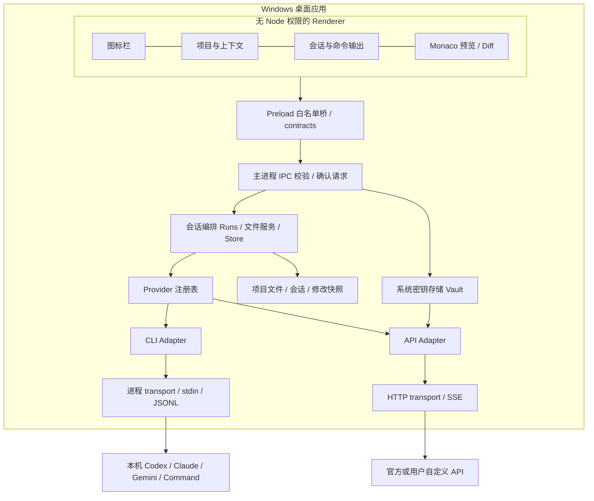

# 多模型 CLI 集成助手：架构与实施方案

## 产品边界与 MVP 优先级

交付形态是 Windows x64 Electron 桌面应用。React 只是窗口渲染技术；生产版加载本地资源，不依赖网站、浏览器或本地 HTTP 后端。开发服务器只用于开发热更新。

| 优先级 | 功能 | v0.1 状态 |
|---|---|---|
| P0 | 四栏桌面窗口、图标菜单、可折叠可拖动面板 | 已实现 |
| P0 | 项目选择、目录树、会话、显式文件上下文 | 已实现 |
| P0 | 七类 CLI/API 连接、统一流、停止/超时/错误 | 已实现，真实平台联调范围见 VALIDATION |
| P0 | 文件预览、语法高亮、行号、编辑副本、diff | 已实现，本地 Monaco assets，无 CDN |
| P0 | 提案确认、哈希冲突检测、单文件应用和回滚 | 已实现，UTF-8 现有文件 |
| P0 | Key 系统加密、受限 IPC、命令主题确认 | 已实现 |
| P0 | Windows 便携目录、数据复制、项目重新定位 | 已实现 |
| P1 | 交互式 PTY、xterm.js、终端尺寸变化 | 待实现，当前是非交互 PowerShell/CLI |
| P1 | CLI 能力探测、版本兼容矩阵、厂商会话恢复 | 当前只有 --version 检测；会话历史由应用回放 |
| P1 | Git worktree、跨文件事务、冲突合并和新文件 | 待实现 |
| P1 | 会话检索/删除/导出、数据保留与加密导出 | 检索与删除已实现；导出与保留策略待实现 |
| P2 | MCP/tool calling、插件隔离、任务队列、成本统计 | 待实现 |
| P2 | Windows MSIX/签名、升级、无障碍完整审计 | 待实现 |

首版把“能看到发生了什么、能审核修改、能复制迁移”作为验收目标。不把 CLI 只读参数描述成完整安全沙箱。

## 技术栈选择

| 层 | 选型 | 原因与代价 |
|---|---|---|
| 桌面容器 | Electron | Windows 进程调用和 npm CLI 生态整合直接；自带运行时方便复制，代价是体积/内存较大 |
| UI | React + TypeScript + Vite | UI 可独立迭代，组件化，不访问文件/进程权限 |
| 编辑器 | Monaco Editor | 语法高亮、行号、编辑和 diff；所有 workers/fonts 本地打包 |
| 契约 | TypeScript + Zod | 共享 DTO，主进程对所有输入做运行时验证 |
| 会话与文件服务 | 独立 TypeScript 模块 | 不依赖 React/Electron，可单独测，未来替换桌面容器 |
| Provider | Adapter + Process/HTTP transports | 不同厂商输出统一成 text/status/error/done |
| 存储 | 原子 JSON 快照 + 变更日志 | 个人 MVP 简单可备份；大数据量转 SQLite + migrations |
| 密钥 | Electron safeStorage / Windows DPAPI | 操作系统加密，拒绝明文 fallback；跨机器重新配置 |
| 打包 | electron-builder dir | 整目录复制，包括 EXE、资源、portable.flag；后续可压缩 ZIP |
| 测试 | Node test runner + Playwright Electron | 核心安全/协议测试与实际桌面端到端验证 |

## 架构图



## 模块边界与数据流

| 模块 | 责任 | 不承担的责任 |
|---|---|---|
| `apps/ui` | 四栏展示、输入、流渲染、面板状态 | 不读密钥、不直接读盘、不启动进程 |
| `packages/contracts` | 配置 schema、请求响应类型、流事件 | 不导入 UI 和平台 API |
| `apps/desktop` | 生命周期、原生目录选择、确认请求管理、IPC、safeStorage | 不解析厂商输出 |
| `packages/core` | 项目/会话、上下文、修改提案和恢复 | 不引用 React |
| `packages/providers` | 适配器、进程调用、SSE/JSONL、超时响应 | 不决定界面布局或文件写权限 |
| `tests` | 契约、安全与流测试 | 不依赖付费模型或真实 Key |

### 一轮对话

1. UI 提交会话 ID、提示、明确勾选的相对文件路径。
2. 主进程校验来源 frame、请求 schema、会话/项目/Provider 关系。
3. 主题对话框显示主进程确认请求中的目标 CLI 或 API、项目、上下文数量/费用提醒。
4. Runs 读取受保护路径检查后的快照，构造最近 20 条消息与本轮上下文。
5. CLI 从 stdin 收到提示，不将它插入 shell 命令。API Key 只在主进程取出放进 HTTP header。
6. Adapter 将厂商输出转为统一事件，主进程把事件推送给正确会话，UI 实时渲染。
7. 文本中 `lp-edit` 代码块经 JSON 解析，只接受本轮上下文中的现有文件。
8. FileService 保存 before/after/baseHash 的待审核提案，不自动写文件。
9. 用户预览 diff 并确认；主进程再次比对哈希，写同目录临时文件后 rename。
10. 回滚同样检查当前内容哈希。重启后根据 applying/rolling-back 日志状态和实际内容恢复状态。

临时文件 + rename 降低半写入风险，不等同于断电耐久事务；外部恶意进程在最终检查和 rename 间仍可能造成 TOCTOU。严格隔离需要 worktree/容器/OS 沙箱与受控文件句柄。

## CLI 适配器设计

```typescript
interface ProviderAdapter {
  run(input: {
    config: ProviderConfig;
    cwd: string;
    prompt: string;
    signal: AbortSignal;
    key?: string;
  }, emit: (event: { type: 'text' | 'status'; text: string }) => void): Promise<void>;
  probe(config: ProviderConfig): Promise<string>;
}
```

生命周期：主进程授权 → reserve run ID → 准备上下文 → run → 流事件 → 完成/异常 → finally 保存、清理。每个会话只允许一个运行；不同会话可同时运行。停止和超时共用 AbortController。Windows 使用 taskkill /T /F 终止进程树；Unix 后备路径终止进程组。

| Adapter | 输入 | 输出解析 | 工具控制 |
|---|---|---|---|
| Codex CLI | `exec --json --sandbox read-only` + stdin `-` | item.completed / agent_message | 请求只读，approval_policy never |
| Claude Code | `-p --output-format stream-json --verbose --include-partial-messages` + stdin | text_delta；非增量版本回退 assistant 内容 | `--tools ""`，strict empty MCP |
| Gemini CLI | `-p` + stdin，`--output-format stream-json` | assistant message / content | `--approval-mode plan` |
| Command CLI（cmdc） | `-p` + stdin，`--output-format json` | event.text_delta / result.finalText | `--permission-mode plan`；禁用会话持久化与 skills、跳过 onboarding 和自动更新 |
| OpenAI/兼容 | chat/completions POST | SSE choices.delta.content | 首版无自动工具调用 |
| Anthropic | messages POST | content_block_delta，message_stop | 同上 |
| Gemini API | OpenAI 兼容基础端点 | 同 OpenAI SSE | 同上 |

Windows `.cmd` 不是经 shell 拼接启动。解析标准 npm wrapper 的 JS 入口，使用 Electron 的 Node 模式运行，CLI 原有 HOME/USERPROFILE/PATH 保留。无法安全解析的 wrapper 报错并要求指定 .exe/.js；不猜测任意批处理逻辑。

不自动安装 CLI、不调用登录命令、不打开 OAuth 页面，不读取第三方 token 文件。CLI 继承本机环境，可能采用原 CLI 已有 OAuth 凭证；这是复用现有登录态，不是应用实现 OAuth 流程。无效凭证报错后由用户在外部处理。

重试策略：API 仅对尚未消费正文的 429/502/503/529 重试最多两次，遵循有限 Retry-After 和退避；网络中断、部分输出、命令/CLI 执行不重放，避免重复成本和副作用。所有流有大小上限；失败保留已收到文本。

新增 Provider：增加 kind/schema → 实现 Adapter → 注册 → 增加配置 UI 元数据 → fixture 测试。核心 Runs 不写厂商分支。未来将 UI label/配置字段放入适配器元数据，进一步减少 UI 改动。

PTY 阶段采用可选 transport，接口增加 stdin write、resize、exit 信号；Windows ConPTY + node-pty，UI 使用 xterm.js。PTY 输出是终端字节流，不能假装等同结构化模型事件。交互式原 CLI 直接修改文件时，使用 worktree 收集真实 diff 与批准合并，避免宣称所有写入都受当前提案系统管理。

## 四栏布局与交互

- 第一栏 56px，仅图标，原生 title tooltip 和 aria-label；工作台、会话、模型、终端、设置。底部放折叠入口。
- 第二栏默认 258px，190–380px 可拖动；项目下拉、会话、递归文件树、上下文复选框和数量。Ctrl+B 折叠。
- 第三栏自适应，至少 330px；会话标签、执行状态、逐条消息、日志、修改记录、上下文 chips、输入框、模型选择、运行/停止。Ctrl+Enter 发送。模型随会话固定。
- 第四栏默认 440px，280–720px 可拖动；路径、只读/编辑切换、Monaco、本地 diff、应用/回滚入口。Ctrl+J 折叠。窄窗口可折叠面板；总宽度超出时横向滚动，不重排成网站移动布局。
- 文件树选择打开预览；反引号包围的相对文件路径可跳转，接受 path:line 后缀（目前打开文件，不定位具体行）；文本和日志均作为普通文本渲染，不执行模型 HTML。
- 编辑默认只是内存副本；离开未保存副本需确认；生成提案后才进入 diff 审核。
- terminal 导航切换命令输入，同一输出区显示 stdout/stderr。日志仅在当前 UI 生命周期保留，不代表持久终端录制。

## 安全与数据策略

1. Renderer 开启 contextIsolation、sandbox，关闭 nodeIntegration；preload 只提供白名单方法，不暴露通用 invoke/exec。
2. IPC 检查 sender、顶层 frame、应用 URL；Zod 验证输入；禁用外部导航、新窗口、webview 和浏览器权限。
3. CSP 限制资源来源；编辑器/字体/worker 本地加载；API 网络请求由主进程执行。禁止凭证 URL、HTTP 外网、自动跨地址重定向。
4. 目录由原生选择器登记，UI 只传项目 ID/相对路径；阻止 `..`、绝对路径、NTFS ADS、尾随点/空格、symlink/junction。默认过滤 `.env*`、`.git`、常见 Key 扩展和凭证目录。
5. API Key 通过 safeStorage 保存密文，不回传明文；空值可清除，省略表示保留。加密不可用时拒绝保存。按已知 Key 跨 chunk 脱敏，但不能可靠识别所有终端/CLI 私密输出。
6. 不上传应用数据、不加遥测；调用远端模型会发送提示/历史/上下文，本地优先不代表模型在本地推理。
7. 命令逐次确认，主进程无任意静默命令接口；终端拥有当前用户权限。CLI 按其原有权限运行，不能从 prompt 约定推导出 OS 安全保证。
8. 单实例防止同一应用的数据并发写。JSON 是原子替换，无索引/无限增长治理；建议重要项目额外 Git 备份。

## 开发路线图（个人项目估算）

| 阶段 | 预计工作量 | 验收 |
|---|---|---|
| v0.1 基础 MVP | 本仓库当前实现 | 桌面可启动、七种协议适配、文件审核链路、便携目录 |
| v0.2 稳定化 | 约 1–2 周 | 四个 CLI 实际账号验证矩阵，故障 fixture，运行日志持久化，更多路径/权限测试 |
| v0.3 编辑与隔离 | 约 2–3 周 | worktree、多文件事务、新建/删除/重命名、冲突合并、恢复演练 |
| v0.4 交互终端 | 约 1–2 周 | ConPTY/node-pty、xterm、多终端、尺寸与 Unicode/ANSI 测试 |
| v0.5 发布体验 | 约 1–2 周 | SQLite migration、会话导出/删除、签名、自动更新、敏感数据保留策略 |

时间为范围估算，CLI 兼容性和 Windows 原生依赖会影响排期。

## 主要风险与替代方案

| 风险 | 当前应对 | 替代/下一步 |
|---|---|---|
| CLI 参数/JSON schema 变化 | 最小参数、错误显式呈现、解析 fixture | 版本协商与能力探测；必要时直连 API |
| CLI 安装或登录态不完整 | --version 检测，不代理登录 | 用户独立安装/修复；API Key 连接 |
| CLI hook/插件越权与 prompt injection | 可信项目、工具限制、逐次启动确认 | 专用 Windows 低权限用户、容器/VM、worktree；worktree 本身不是沙箱 |
| OAuth/账号条款差异 | 不实现登录，不复制 token | 遵循各 CLI 官方登录支持，手动 API Key |
| Windows PTY 原生依赖 | MVP 使用标准 pipes | 独立可选 node-pty transport，保留 pipes 回退 |
| Electron 包体大 | 本地资源打包、目录便携 | Tauri 2 + Rust transport 可减体积，但引入 Rust/IPC/WebView2 兼容成本 |
| Key 跨机不可解密 | 重新填写，不明文导出 | 后续提供用户口令加密导出，需 KDF 与版本格式设计 |
| JSON 存储随历史增大 | 文件/提示限额、单实例、原子替换 | SQLite WAL、分页、清理策略和 migrations |
| API 格式/模型名差异 | 手填模型 ID、基础地址配置 | 增加独立 Responses API、供应商 capability metadata |
| Windows 未签名 EXE | 个人便携测试版 | 发布前代码签名；SmartScreen 信任需实际分发验证 |

## 官方参考入口

调研尝试通过 web 工具打开官方文档，但该环境没有返回可用网页内容，未据此声称最新版本兼容。实现校验主要来自本机 CLI --help 和安装包，详见 VALIDATION。可后续核对：

- OpenAI 官方 Codex CLI reference / non-interactive 文档。
- Anthropic Claude Code 官方 headless / CLI reference 文档。
- Google Gemini CLI 官方 headless / CLI reference / OpenAI compatibility 文档。
- Electron 官方 security、safeStorage、contextBridge 文档。

版本不能仅根据文档标题推断；上线前应以实际安装版本的帮助、流 fixture 和真实账号回归为准。

窗口采用自绘主题标题栏，最小化/最大化/还原/关闭通过受限 IPC 调用。预览开关位于左上角同一栏。主进程以唯一请求 ID 等待主题确认框响应；重载、窗口关闭或渲染进程退出时拒绝未决请求。会话删除在确认前后均检查运行状态，保留文件修改记录。
